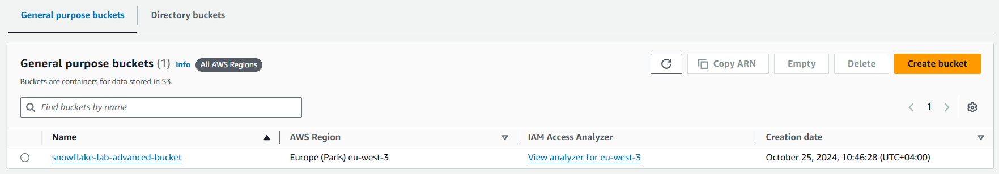
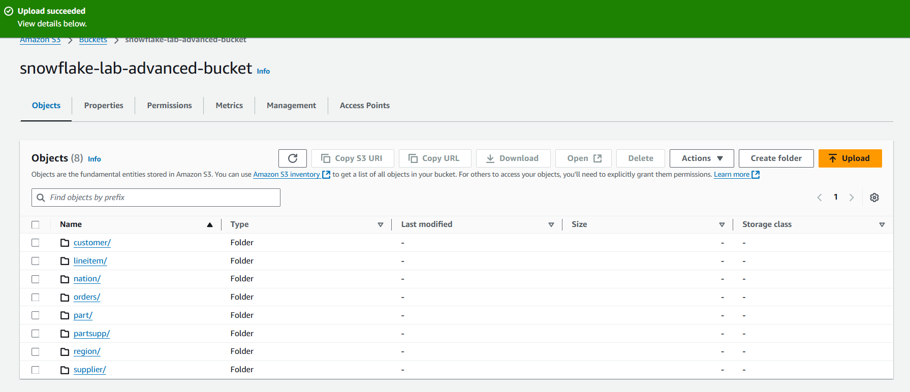
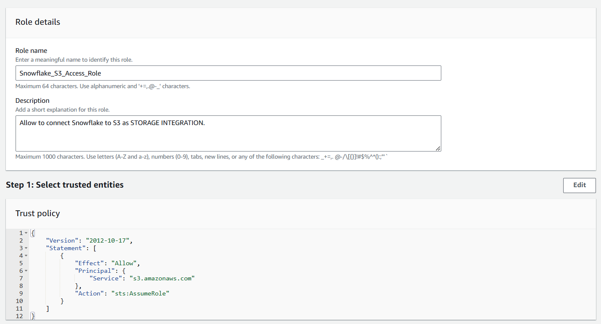
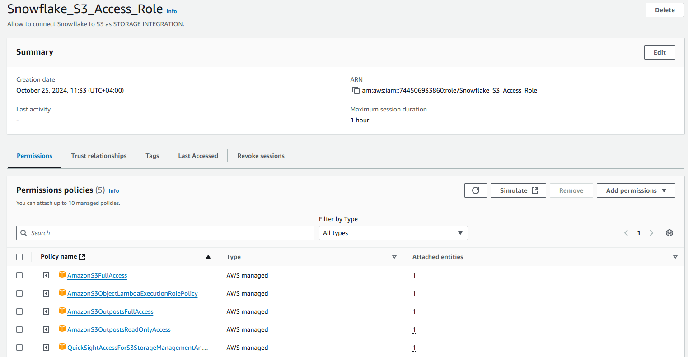

# Snowflake Lab 2

Link to repository: 

## Task 1: AWS S3 Integration

### Configuring S3 bucket

Creating AWS S3 bucket with public access allowed:


### Uploading data to bucket
Uploading preprocessed files to appropriate bucket folders:


### Configuring IAM Role
Creating IAM Role with full-access permission on bucket:



### Set-up STORAGE INTEGRATION in Snowflake

Creating `STORAGE INTEGRATION` in Snowflake using created bucket and IAM role.

```sql
CREATE STORAGE INTEGRATION s3_integration
TYPE = EXTERNAL_STAGE
STORAGE_PROVIDER = S3
ENABLED = TRUE
STORAGE_AWS_ROLE_ARN = 'arn:aws:iam::744506933860:role/Snowflake_S3_Access_Role'
STORAGE_ALLOWED_LOCATIONS = ('s3://snowflake-lab-advanced-bucket/');
```

### External tables creation

1. For preprocessed files in S3 custom file format `CSV_FORMAT` was created.
2. Creation of external tables in `CORE_DWH` was wrapped in stored procedure `create_external_tables_in_core_dwh`.

```sql
CREATE OR REPLACE FILE FORMAT CSV_FORMAT
TYPE = 'CSV'
FIELD_DELIMITER = ';'
field_optionally_enclosed_by='"'
SKIP_HEADER = 1
DATE_FORMAT = 'DD.MM.YY';

CREATE OR REPLACE PROCEDURE create_external_tables_in_core_dwh(message VARCHAR)
RETURNS VARCHAR NOT NULL
LANGUAGE SQL
AS
BEGIN
    drop external table region_ext;
    create external table region_ext
    (
      r_regionkey INTEGER,
      r_name      CHAR(25),
      r_comment   VARCHAR(152)
    )
    LOCATION = ('s3://snowflake-lab-advanced-bucket/region/')
    FILE_FORMAT = CSV_FORMAT;
    
    
    drop external table nation_ext;
    create external table nation_ext
    (
      n_nationkey INTEGER not null,
      n_name      CHAR(27),
      n_regionkey INTEGER,
      n_comment   VARCHAR(155)
    )
    LOCATION = ('s3://snowflake-lab-advanced-bucket/nation/')
    FILE_FORMAT = CSV_FORMAT;
    
    
    drop external table supplier_ext;
    create external table supplier_ext
    (
      s_suppkey   INTEGER not null,
      s_name      CHAR(25),
      s_address   VARCHAR(40),
      s_nationkey INTEGER,
      s_phone     CHAR(15),
      s_acctbal   FLOAT8,
      s_comment   VARCHAR(101)
    )
    LOCATION = ('s3://snowflake-lab-advanced-bucket/supplier/')
    FILE_FORMAT = CSV_FORMAT;
    
    
    drop external table orders_ext;
    create external table orders_ext
    (
      o_orderkey      INTEGER not null,
      o_custkey       INTEGER not null,
      o_orderstatus   CHAR(1),
      o_totalprice    FLOAT8,
      o_orderdate     DATE,
      o_orderpriority CHAR(15),
      o_clerk         CHAR(15),
      o_shippriority  INTEGER,
      o_comment       VARCHAR(79)
    )
    LOCATION = ('s3://snowflake-lab-advanced-bucket/orders/')
    FILE_FORMAT = CSV_FORMAT;
    
    
    drop external table partsupp_ext;
    create external table partsupp_ext
    (
      ps_partkey    INTEGER not null,
      ps_suppkey    INTEGER not null,
      ps_availqty   INTEGER,
      ps_supplycost FLOAT8 not null,
      ps_comment    VARCHAR(199)
    )
    LOCATION = ('s3://snowflake-lab-advanced-bucket/partsupp/')
    FILE_FORMAT = CSV_FORMAT;
    
    
    drop external table part_ext;
    create external table part_ext
    (
      p_partkey     INTEGER not null,
      p_name        VARCHAR(55),
      p_mfgr        CHAR(25),
      p_brand       CHAR(10),
      p_type        VARCHAR(25),
      p_size        INTEGER,
      p_container   CHAR(10),
      p_retailprice INTEGER,
      p_comment     VARCHAR(23)
    )
    LOCATION = ('s3://snowflake-lab-advanced-bucket/part/')
    FILE_FORMAT = CSV_FORMAT;
    
    
    drop external table customer_ext;
    create external table customer_ext
    (
      c_custkey    INTEGER not null,
      c_name       VARCHAR(25),
      c_address    VARCHAR(40),
      c_nationkey  INTEGER,
      c_phone      CHAR(15),
      c_acctbal    FLOAT8,
      c_mktsegment CHAR(10),
      c_comment    VARCHAR(117)
    )
    LOCATION = ('s3://snowflake-lab-advanced-bucket/customer/')
    FILE_FORMAT = CSV_FORMAT;
    
    
    drop external table lineitem_ext;
    create external table lineitem_ext
    (
      l_orderkey      INTEGER not null,
      l_partkey       INTEGER not null,
      l_suppkey       INTEGER not null,
      l_linenumber    INTEGER not null,
      l_quantity      INTEGER not null,
      l_extendedprice FLOAT8 not null,
      l_discount      FLOAT8 not null,
      l_tax           FLOAT8 not null,
      l_returnflag    CHAR(1),
      l_linestatus    CHAR(1),
      l_shipdate      DATE,
      l_commitdate    DATE,
      l_receiptdate   DATE,
      l_shipinstruct  CHAR(25),
      l_shipmode      CHAR(10),
      l_comment       VARCHAR(44)
    )
    LOCATION = ('s3://snowflake-lab-advanced-bucket/lineitem/')
    FILE_FORMAT = CSV_FORMAT;

  RETURN 'External tables in CORE_DWH were created.';
END;

CALL create_external_tables_in_core_dwh('');
```

## Task 2: Data Ingestion

### Tech Tables Creation

Table `INGEST`, containing SQL-commands for inserting as table-rows:
```sql
CREATE TABLE TECH_DBO.INGEST (
  script_id INT AUTOINCREMENT PRIMARY KEY,
  table_to_change STRING,
  script_text STRING,
  description STRING,
  created_at TIMESTAMP DEFAULT CURRENT_TIMESTAMP()
);
```

Table `INGEST_LOG` for capturing details of each `INSERT` statement execution:
```sql
CREATE TABLE TECH_DBO.INGEST_LOG (
  log_id INT AUTOINCREMENT PRIMARY KEY,
  script_id INT,
  rows_written INT,
  status STRING,
  FOREIGN KEY (script_id) REFERENCES TECH_DBO.INGEST(script_id)
);
```

### Populate Scripts

Populating rows of table `TECH_DBO.INGEST` with scripts:
```sql

```

### Procedure running Ingestion Scripts

Stored procedure `execute_ingestion_script(specific_table STRING)` is used to run ingestion script stored in
`TECH_DBO.INGESTION` table and writes log-data into `TECH_DBO.INGEST_LOG` table.
```sql
CREATE OR REPLACE PROCEDURE execute_ingestion_script(specific_table STRING)
RETURNS STRING
LANGUAGE SQL
AS
BEGIN
  DECLARE script_to_execute AS STRING;
  DECLARE script_id AS INT;
  DECLARE rows_affected AS INT;
  DECLARE error_message AS STRING;
  DECLARE status_text AS STRING;

  SET script_to_execute = (
        SELECT script_text
        FROM TECH_DBO.INGEST
        WHERE table_to_change = specific_table
        ORDER BY created_at DESC
        LIMIT 1
  );
  SET script_id = (
        SELECT script_id
        FROM TECH_DBO.INGEST
        WHERE table_to_change = specific_table
        ORDER BY created_at DESC
        LIMIT 1
  );


  IF script_to_execute IS NOT NULL THEN
    EXECUTE IMMEDIATE script_to_execute;

    SET rows_affected = SQLROWCOUNT;
    SET status_text = 'Success';

    INSERT INTO TECH_DBO.INGEST_LOG (script_id, rows_affected, status_text);
    RETURN 'Script executed successfully.';
  ELSE
    SET rows_affected = 0;
    SET status_text = 'Fail';

    INSERT INTO TECH_DBO.INGEST_LOG (script_id, rows_affected, status_text);
    RETURN 'No script found for the specified table.';
  END IF;
END;
```

### Streams Creation

Creating streams for all external tables in `CORE_DWH`:
```sql
CREATE OR REPLACE STREAM customer_stream ON EXTERNAL TABLE CORE_DWH.customer_ext INSERT_ONLY = TRUE;
CREATE OR REPLACE STREAM lineitem_stream ON EXTERNAL TABLE CORE_DWH.lineitem_ext INSERT_ONLY = TRUE;
CREATE OR REPLACE STREAM nation_stream ON EXTERNAL TABLE CORE_DWH.nation_ext INSERT_ONLY = TRUE;
CREATE OR REPLACE STREAM orders_stream ON EXTERNAL TABLE CORE_DWH.order_ext INSERT_ONLY = TRUE;
CREATE OR REPLACE STREAM part_stream ON EXTERNAL TABLE CORE_DWH.part_ext INSERT_ONLY = TRUE;
CREATE OR REPLACE STREAM partsupp_stream ON EXTERNAL TABLE CORE_DWH.partsupp_ext INSERT_ONLY = TRUE;
CREATE OR REPLACE STREAM region_stream ON EXTERNAL TABLE CORE_DWH.region_ext INSERT_ONLY = TRUE;
CREATE OR REPLACE STREAM supplier_stream ON EXTERNAL TABLE CORE_DWH.supplier_ext INSERT_ONLY = TRUE;
```

### Tasks on Streams

Creating 8 tasks for each stream to capture corresponding external tables changes:
```sql
CREATE OR REPLACE TASK TECH_DBO.customer_task
  WAREHOUSE = COMPUTE_WH
  SCHEDULE = '1 MINUTE'
WHEN
  SYSTEM$STREAM_HAS_DATA('CORE_DWH.customer_stream')
AS
  CALL execute_ingestion_script('customer');

CREATE OR REPLACE TASK TECH_DBO.lineitem_task
  WAREHOUSE = COMPUTE_WH
  SCHEDULE = '1 MINUTE'
WHEN
  SYSTEM$STREAM_HAS_DATA('CORE_DWH.lineitem_stream')
AS
  CALL execute_ingestion_script('lineitem');

CREATE OR REPLACE TASK TECH_DBO.nation_task
  WAREHOUSE = COMPUTE_WH
  SCHEDULE = '1 MINUTE'
WHEN
  SYSTEM$STREAM_HAS_DATA('CORE_DWH.nation_stream')
AS
  CALL execute_ingestion_script('nation');

CREATE OR REPLACE TASK TECH_DBO.orders_task
  WAREHOUSE = COMPUTE_WH
  SCHEDULE = '1 MINUTE'
WHEN
  SYSTEM$STREAM_HAS_DATA('CORE_DWH.orders_stream')
AS
  CALL execute_ingestion_script('orders');

CREATE OR REPLACE TASK TECH_DBO.part_task
  WAREHOUSE = COMPUTE_WH
  SCHEDULE = '1 MINUTE'
WHEN
  SYSTEM$STREAM_HAS_DATA('CORE_DWH.part_stream')
AS
  CALL execute_ingestion_script('part');

CREATE OR REPLACE TASK TECH_DBO.partsupp_task
  WAREHOUSE = COMPUTE_WH
  SCHEDULE = '1 MINUTE'
WHEN
  SYSTEM$STREAM_HAS_DATA('CORE_DWH.partsupp_stream')
AS
  CALL execute_ingestion_script('partsupp');

CREATE OR REPLACE TASK TECH_DBO.region_task
  WAREHOUSE = COMPUTE_WH
  SCHEDULE = '1 MINUTE'
WHEN
  SYSTEM$STREAM_HAS_DATA('CORE_DWH.region_stream')
AS
  CALL execute_ingestion_script('region');

CREATE OR REPLACE TASK TECH_DBO.supplier_task
  WAREHOUSE = COMPUTE_WH
  SCHEDULE = '1 MINUTE'
WHEN
  SYSTEM$STREAM_HAS_DATA('CORE_DWH.supplier_stream')
AS
  CALL execute_ingestion_script('supplier');
```

### Orchestration Task

Procedure for enabling ingestion tasks, inserting rows in corresponding table:
```sql
CREATE OR REPLACE PROCEDURE resume_ingestion_tasks()
RETURNS VARCHAR NOT NULL
LANGUAGE SQL
AS
BEGIN
    ALTER TASK customer_task() RESUME;
    ALTER TASK lineitem_task() RESUME;
    ALTER TASK nation_task() RESUME;
    ALTER TASK order_task() RESUME;
    ALTER TASK part_task() RESUME;
    ALTER TASK partsupp_task() RESUME;
    ALTER TASK region_task() RESUME;
    ALTER TASK supplier_task() RESUME;
    
    RETURN 'Ingestion tasks were started.'
END;
```

Creating chron task for orchestration ingestion tasks created above:
```sql
CREATE TASK run_ingestion_task
WAREHOUSE = your_warehouse
SCHEDULE = '5 MINUTE'
AS
CALL resume_ingestion_tasks();
```